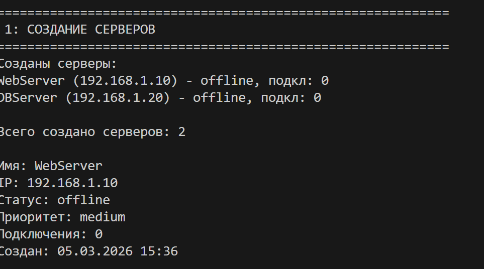
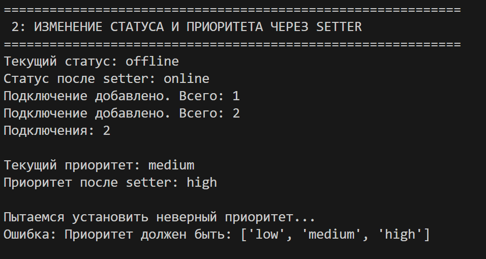

# Лабораторная работа №1
## Тема: IT-инфраструктура. Класс Server

### Идея работы
Создание класса `Server`, который моделирует работу сервера в IT-инфраструктуре. 
Класс содержит информацию о сервере (имя, IP, ОС, CPU, RAM), его состоянии 
(статус, приоритет, подключения) и методы для управления им.

### Цели лабораторной работы
- Освоить объявление пользовательских классов
- Разобраться с инкапсуляцией (закрытые поля _attribute)
- Реализовать свойства (@property)
- Переопределить магические методы (__str__, __repr__, __eq__)
- Осознать разницу между атрибутами класса и экземпляра

 
### Класс Server

**Атрибуты класса:**
- `available_os` — список доступных ОС
- `total_servers` — счетчик созданных серверов

**Закрытые поля:**
- `_name`, `_ip_address`, `_os_type`, `_cpu_cores`, `_ram_gb`
- `_status` (offline/online/maintenance)
- `_priority` (low/medium/high)
- `_connections` — количество подключений
- `_created_at` — дата создания

**Свойства @property:**
- Чтение: `name`, `ip_address`, `os_type`, `cpu_cores`, `ram_gb`, `connections`, `created_at`
- Чтение и запись: `status`, `priority` (с валидацией)
- Вычисляемое: `uptime` — время работы

**Магические методы:**
- `__str__` — для print (читаемое описание)
- `__repr__` — для разработчиков
- `__eq__` — сравнение по IP-адресу

**Бизнес-методы:**
- `start()`, `stop()`, `maintenance()`
- `add_connection()`, `remove_connection()`
- `get_info()`

   
## Демонстрация работы (demo.py)
**Сценарий 1: Создание серверов**

• Создание сервера WebServer с Linux, 4 ядра CPU, 16 ГБ RAM
• Создание сервера DBServer с Windows, 8 ядер CPU, 32 ГБ RAM
• Проверка атрибута класса (счетчик созданных серверов)

Показывает, что каждый сервер получает свои параметры, статус по умолчанию offline, а счетчик созданных серверов увеличивается.

**Сценарий 2: Свойства и изменение состояния**

• Чтение всех свойств сервера (имя, IP, статус, приоритет, подключения)
• Изменение статуса через setter (offline → online)
• Добавление подключений к запущенному серверу
• Изменение приоритета через setter (medium → high)

Демонстрирует работу свойств @property, сеттеров с валидацией и бизнес-методов.

**Сценарий 3: Сравнение серверов**

• Создание сервера с тем же IP-адресом
• Создание сервера с другим IP-адресом
• Сравнение серверов оператором ==

Демонстрирует работу магического метода __eq__, который сравнивает серверы по уникальному IP-адресу.

**Сценарий 4: Обработка ошибок**

• Попытка создания сервера с коротким именем
• Попытка установки неверного статуса
• Попытка установки неверного приоритета

Программа намеренно пытается выполнить некорректные действия, чтобы продемонстрировать защиту от ошибок и валидацию данных.