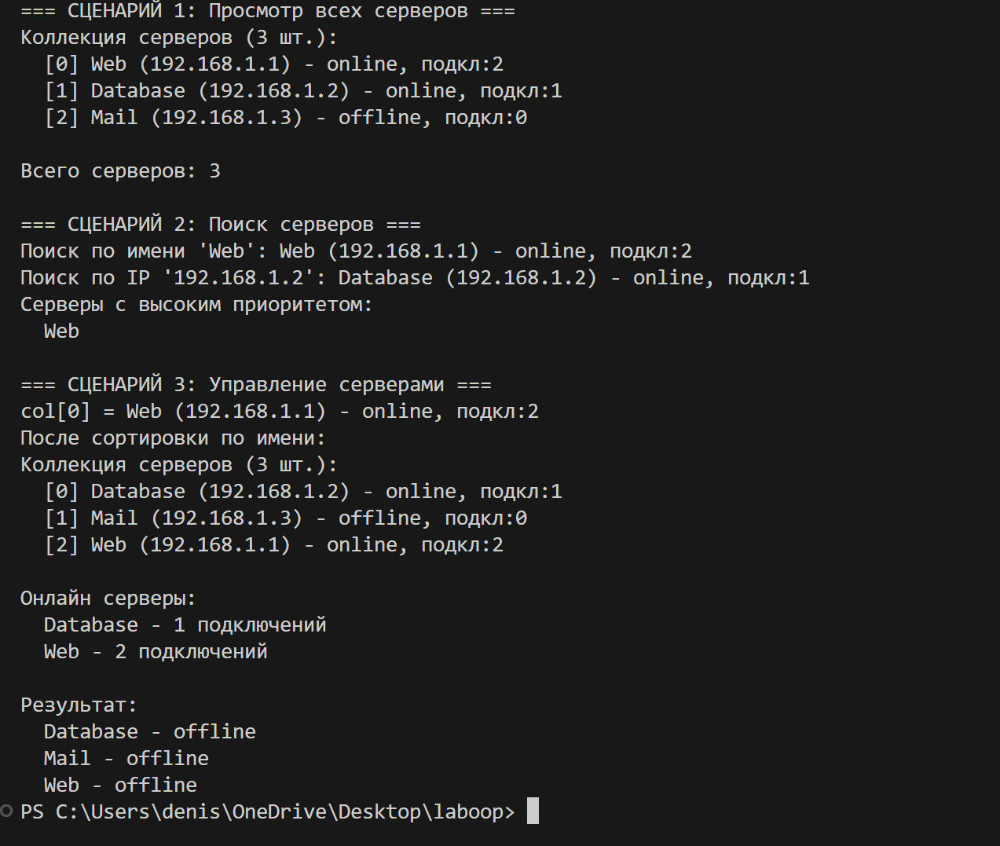

# Лабораторная работа №2: Коллекция объектов

## Вариант
IT-инфраструктура: Server → ServerCollection

## Реализовано

Класс `ServerCollection` для хранения объектов `Server`.

### Методы
- `add()`, `remove()`, `remove_at()` - добавление и удаление
- `find_by_name()`, `find_by_ip()`, `find_by_status()` - поиск
- `sort_by_name()`, `sort_by_connections()` - сортировка
- `get_online()`, `get_all()` - фильтрация

### Магические методы
- `__len__()`, `__iter__()`, `__getitem__()`, `__str__()`

### Защита
- Проверка типа
- Защита от дубликатов

## Файлы
- `validation.py` - валидация
- `model.py` - класс Server
- `collection.py` - класс ServerCollection
- `demo.py` - демонстрация

## Демонстрация работы

**Сценарий 1: Просмотр серверов**

- Вывод коллекции через `print(col)`
- Подсчет серверов через `len(col)`
- Показывает работу `__str__` и `__len__`

**Сценарий 2: Поиск серверов**

- Поиск по имени `find_by_name()`
- Поиск по IP `find_by_ip()`
- Итерация через `for` с фильтром по приоритету
- Показывает работу `__iter__` и методов поиска

**Сценарий 3: Управление серверами**

- Доступ по индексу `col[0]` (работа `__getitem__`)
- Сортировка по имени `sort_by_name()`
- Фильтрация онлайн серверов `get_online()`
- Остановка серверов методом `stop()`

**Обработка ошибок**

- Попытка добавить строку вместо сервера
- Попытка добавить дубликат (одинаковый IP)
- Демонстрирует защиту от неправильных типов и дубликатов

