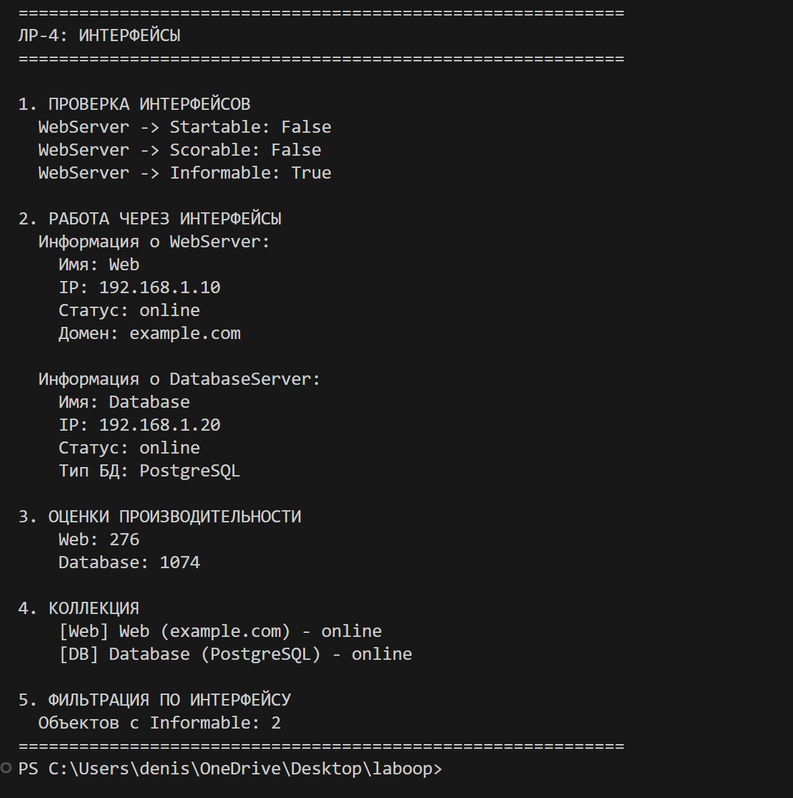

# Лабораторная работа №4: Интерфейсы

## Цель
Научиться создавать интерфейсы через ABC.

## Интерфейсы
 `Startable` - start(), stop()
 `Scorable` - get_score()
 `Informable` - get_info()

## Реализация
 `WebServer` и `DatabaseServer` реализуют все 3 интерфейса

## Демонстрация

1. Проверка интерфейсов (isinstance)
2. Работа через интерфейсы
3. Полиморфизм (get_score)
4. Фильтрация по интерфейсу
