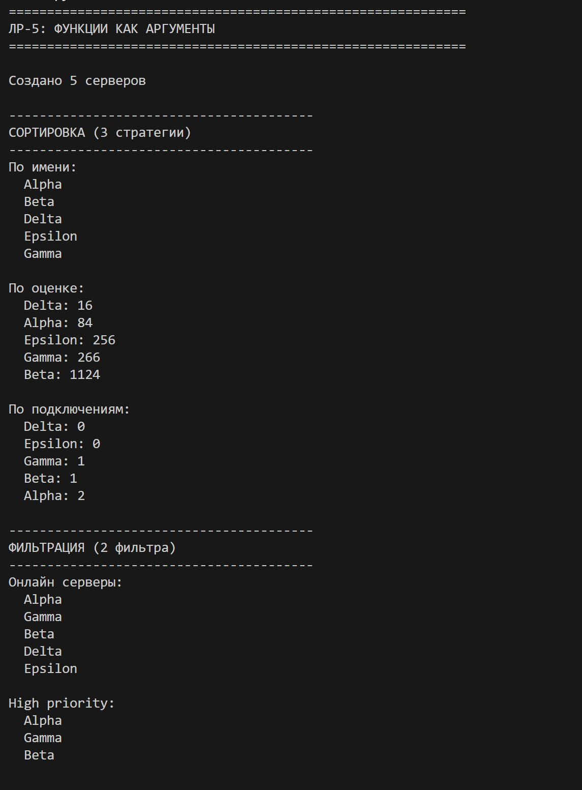
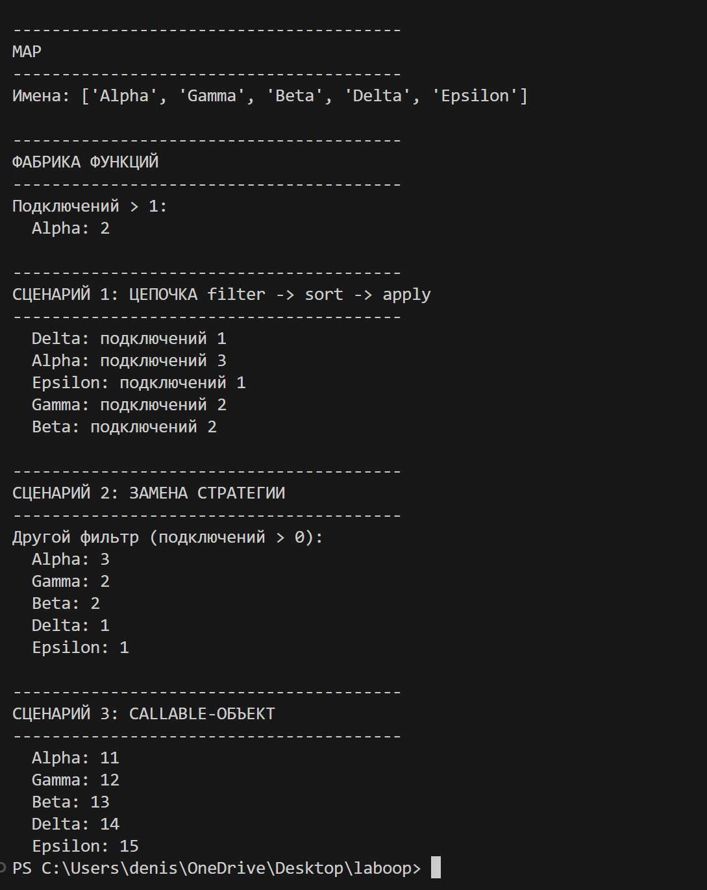

# Лабораторная работа №5: Функции как аргументы

## Цель
Научиться передавать функции как аргументы, использовать map, filter, lambda и паттерн «Стратегия».

## Что сделано

### Функции для сортировки
- `by_name` — по имени
- `by_score` — по оценке
- `by_connections` — по подключениям

### Функции для фильтрации 
- `is_online` — только онлайн
- `is_high_priority` — только высокий приоритет

### Фабрика функций
- `min_connections_filter(min)` — создаёт фильтр для подключений > min

### Callable-объект
- `Counter` — считает количество применений

### Методы коллекции
- `sort_by(rule)` — сортировка по правилу
- `filter_by(rule)` — фильтрация (возвращает новую коллекцию)
- `apply(func)` — применяет функцию ко всем элементам

## Демонстрация (3 сценария)

1. Цепочка `filter → sort → apply`
2. Замена стратегии (разные фильтры)
3. Callable-объект `Counter`

