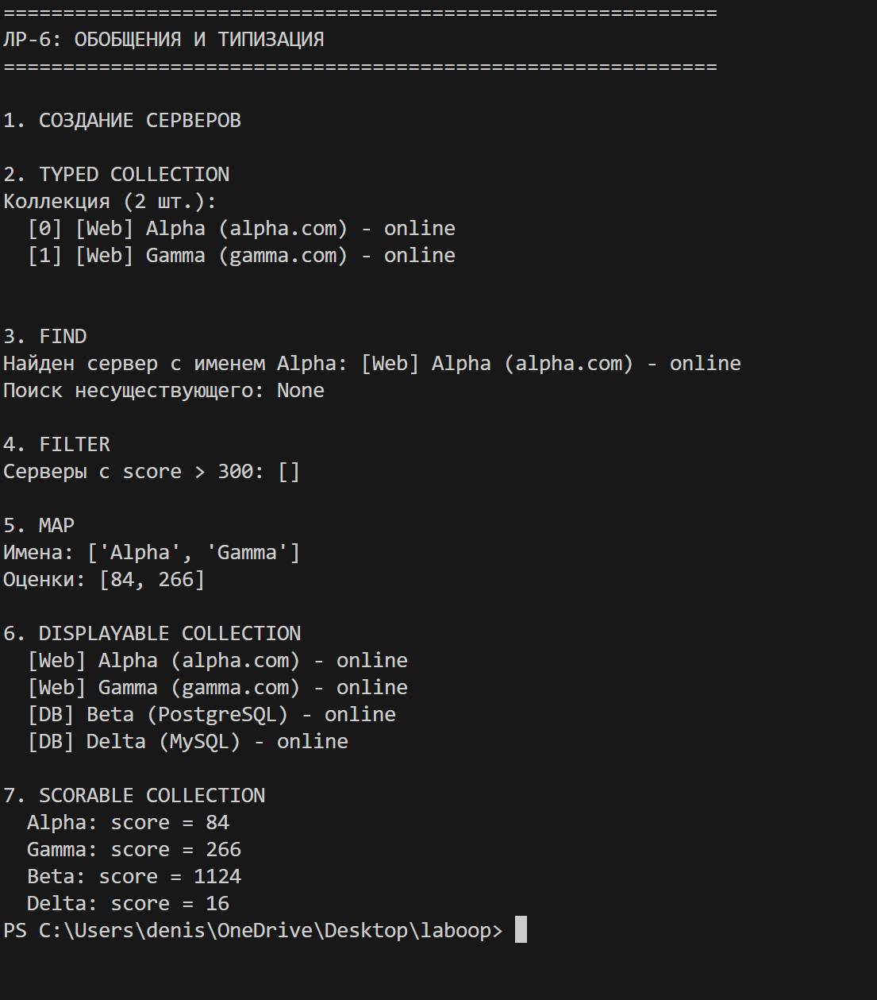

# Лабораторная работа №6: Обобщения и типизация

## Цель
Освоить аннотации типов, Generic-классы, TypeVar и Protocol.

## Что сделано

### Аннотации типов (lab1, lab3)
- Добавлены подсказки типов для параметров и возвращаемых значений

### Generic-коллекция (container.py)
- `TypedCollection[T]` — универсальная коллекция, хранящая тип элементов
- Методы: `add`, `remove`, `find`, `filter`, `map`

### TypeVar
- `T` — любой тип
- `D` — только с методом `display()`
- `S` — только с методом `get_score()`
- `R` — для результата `map` (может отличаться от исходного)

### Protocol
- `Displayable` — требует метод `display()`
- `Scorable` — требует метод `get_score()`

### Ограниченные коллекции
- `DisplayableCollection` — только для объектов с `display()`
- `ScorableCollection` — только для объектов с `get_score()`

## Демонстрация

1. `TypedCollection[WebServer]` — добавление и вывод
2. `find` — поиск элемента
3. `filter` — отбор по условию
4. `map` — преобразование (меняет тип результата)
5. `DisplayableCollection` — объекты без наследования от Protocol
6. `ScorableCollection` — те же объекты в другой коллекции
