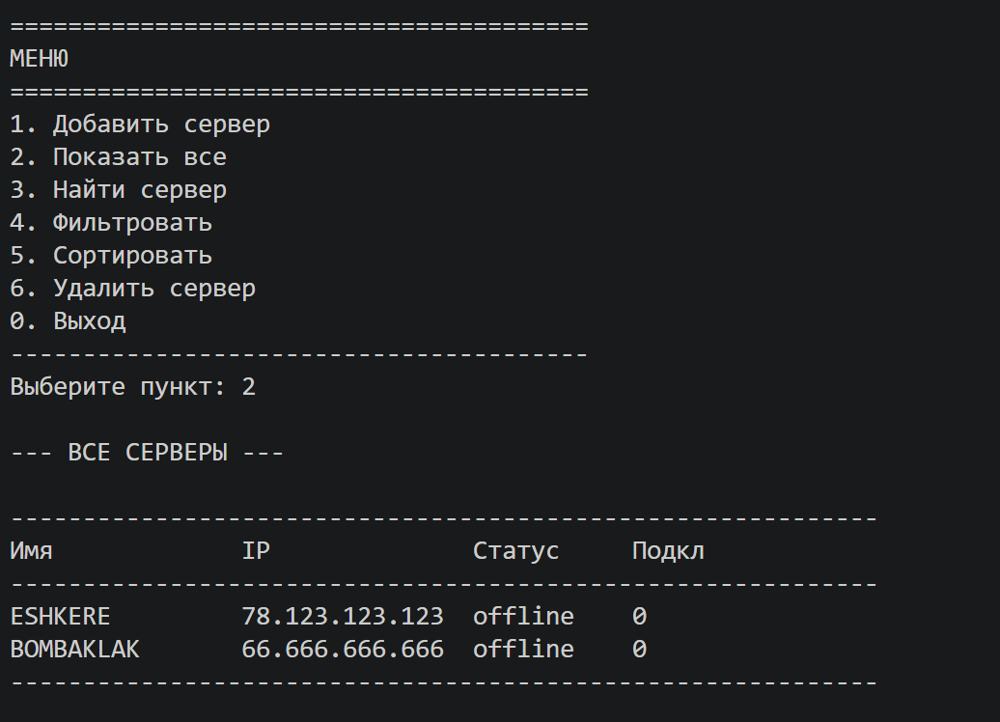
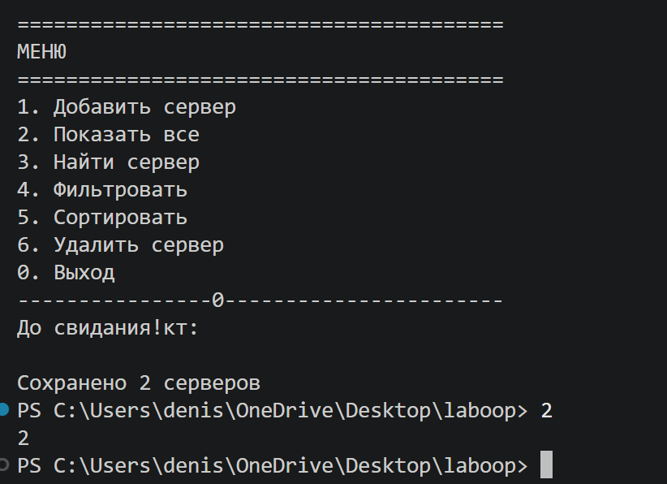
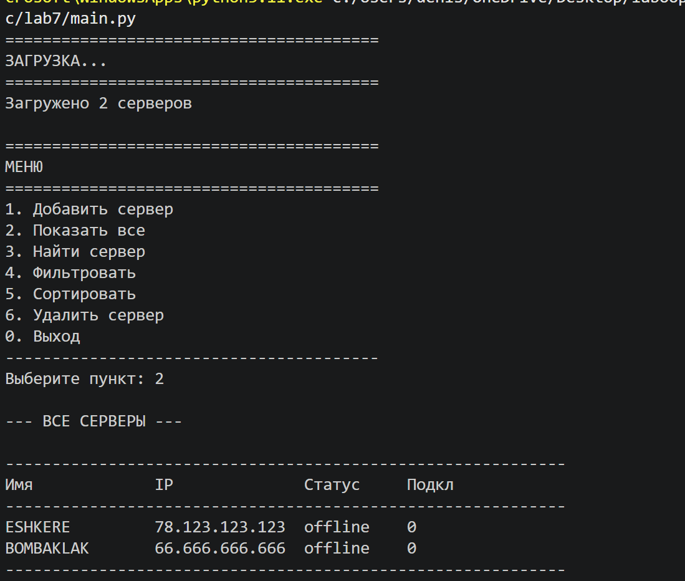
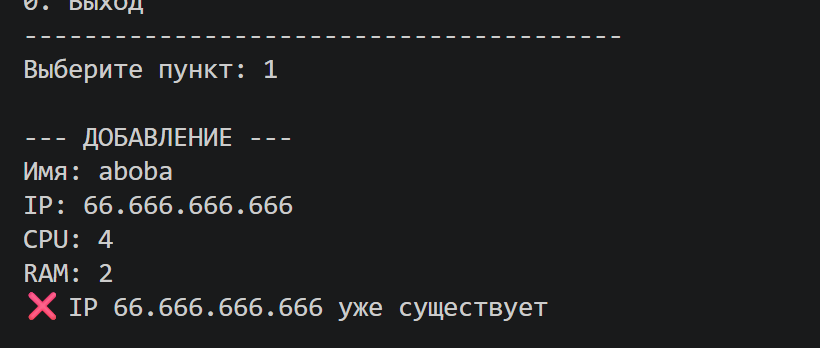
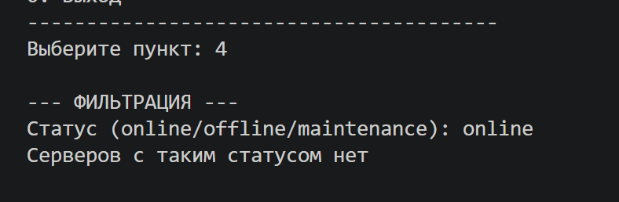

## Описание пунктов

| Пункт | Действие | Что делает |
|-------|----------|------------|
| 1 | Добавить | Запрашивает имя, IP, CPU, RAM и создаёт сервер |
| 2 | Показать все | Выводит таблицу всех серверов |
| 3 | Найти | Поиск по IP или по имени |
| 4 | Фильтровать | Отбирает серверы по статусу (online/offline/maintenance) |
| 5 | Сортировать | Упорядочивает по имени, оценке или подключениям |
| 6 | Удалить | Удаляет сервер по IP с подтверждением y/n |
| 0 | Выход | Сохраняет данные в JSON и закрывает программу |

## Обработка ошибок

| Ситуация | Сообщение |
|----------|-----------|
| Ввод букв вместо цифр | ❌ Ошибка: введите число |
| Неверный пункт меню | Ошибка: неверный пункт |
| Имя короче 3 символов | Имя минимум 3 символа |
| Дубликат IP | ❌ IP 192.168.1.10 уже существует |
| Сервер не найден при удалении | ❌ Сервер не найден |

## Сохранение и загрузка

- **Файл:** `data.json` в папке lab7
- **При запуске:** программа читает файл и загружает серверы
- **При выходе:** программа сохраняет все серверы в файл
- Если файла нет — он создаётся автоматически

## Демонстрация (4 сценария)

# Сценарий 1: Запуск → автозагрузка → вывод всех
# Программа загружает data.json, выводит "Загружено X серверов"
# Пользователь вводит 2 → видит таблицу

# Сценарий 2: Добавление → выход → повторный запуск
# Пользователь вводит 1 → добавляет сервер 
# Вводит 2 → проверяет, что сервер появился
# Вводит 0 → выход (данные сохраняются)
# Повторный запуск → сервер Test отображается в списке

# Сценарий 3: Сортировка
# Пользователь вводит 5 → выбирает 1 (по имени)
# Вводит 2 → видит серверы в алфавитном порядке

# Сценарий 4: Фильтрация + ошибка
# Пользователь вводит 1 → добавляет сервер с существующим IP
# Программа выводит "❌ IP уже существует"
# Пользователь вводит 4 → вводит "online"
# Программа показывает только онлайн серверы